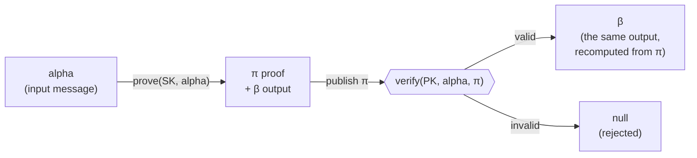

# @renaiss/ecvrf

A small, spec-faithful implementation of the **ECVRF-EDWARDS25519-SHA512-ELL2**
Verifiable Random Function from **[RFC 9381]** (`suite_string = 0x04`).

- 📄 Standard: **RFC 9381** — <https://www.rfc-editor.org/rfc/rfc9381.html> · <https://datatracker.ietf.org/doc/rfc9381/>
- ✅ Validated byte-for-byte against the RFC's official **Appendix B.4** test vectors
- 🧩 One module per spec section, operating on raw bytes — nothing but the standard

[RFC 9381]: https://www.rfc-editor.org/rfc/rfc9381.html

---

## What is a VRF?

A **Verifiable Random Function** is a keyed hash with a public proof. The holder
of a secret key `SK` turns any input message `alpha` into:

- **β (beta)** — a fixed-length output that looks completely random, and
- **π (pi)** — an 80-byte proof.

Anyone with the matching **public key** can check `π` and be certain that:

1. **Uniqueness** — for a given key and input there is exactly **one** valid `β`.
   The key holder cannot "shop around" for a nicer result.
2. **Unpredictability** — without the secret key, `β` is indistinguishable from
   random until the proof is published.
3. **Verifiability** — `β` is recovered *from the proof itself*; you never have
   to trust the producer's word.

That combination is what makes a VRF the right tool for provably-fair draws,
leader election, verifiable lotteries, and any "random but auditable" outcome.



## Install

The package lives in this repo's workspace — clone and depend on it locally:

```sh
git clone https://github.com/Renaiss-Protocol/renaiss-fair.git
cd renaiss-fair && pnpm install
# then, in your workspace package:
#   "@renaiss/ecvrf": "workspace:*"
```

Runtime dependencies are the audited [`@noble/curves`] and [`@noble/hashes`].

[`@noble/curves`]: https://github.com/paulmillr/noble-curves
[`@noble/hashes`]: https://github.com/paulmillr/noble-hashes

## Usage

Everything operates on `Uint8Array`. Keep the secret key secret; publish only the
public key and the proof.

```ts
import {
  keygen,
  prove,
  verify,
  proofToHash,
  secretScalarAndPublicKey,
} from "@renaiss/ecvrf";

// 1. Keys — any 32-byte string is a valid RFC 8032 secret key.
const { SK, pkString } = keygen();

// 2. Prove over some public input.
const alpha = new TextEncoder().encode("block:0xabc…|round:42");
const { piString } = prove(SK, alpha);          // π — 80 bytes, publish this
const beta = proofToHash(piString);             // β — 64 bytes, the output

// 3. Anyone verifies with the public key alone.
const verifiedBeta = verify(pkString, alpha, piString);
if (verifiedBeta === null) throw new Error("invalid proof");
// verifiedBeta is byte-for-byte equal to beta — recomputed, not trusted.
```

`verify` returns the 64-byte `β` on success or `null` for the spec's "INVALID"
(the caller decides what to do — this library never throws on a bad proof).

### Deriving a public key from a secret key

```ts
import { secretScalarAndPublicKey, pointToString } from "@renaiss/ecvrf";
const { Y } = secretScalarAndPublicKey(SK);      // Y = x·B (the public point)
const publicKeyBytes = pointToString(Y);         // 32-byte encoding
```

### Turning β into a stream of numbers

`β` is a single 64-byte value. If you need many random draws from one proof,
expand it with a public counter — anyone can recompute each value, so the whole
stream stays verifiable:

```ts
import { sha512 } from "@noble/hashes/sha2.js";
// draw i = low 53 bits of SHA-512(β ‖ i as 32-byte big-endian), over 2^53 → [0,1)
```

(This expansion is an application convention, not part of the VRF standard, so it
lives outside this package: [`@renaiss/verifiable-draw`](../verifiable-draw)
implements it as `rngFromRandomness`/`randomAt`, and
[`@renaiss/algorithms`](../algorithms) uses exactly the same scheme.)

## Hex at the edges

The core is bytes-only, by design (it stays 1:1 with the paper). Wrapping it for
hex I/O is a few lines:

```ts
import { bytesToHex, hexToBytes } from "viem"; // or any hex util
const proofHex = bytesToHex(prove(SK, hexToBytes(alphaHex)).piString);
```

## Conformance

The implementation is validated **byte-for-byte** against the official RFC 9381
**Appendix B.4** test vectors (Examples 19–21): public-key derivation,
`encode_to_curve` output `H`, the proof `π`, and the output `β`.

```sh
pnpm --filter @renaiss/ecvrf test
```

Example 19 is pinned to its exact published `π` and `β` — reproducing the RFC's
80-byte proof for a known key and input is the definitive statement that this
code *is* the standard, not a lookalike. The suite also covers the "INVALID"
paths (tampered proof, wrong message, wrong key, malformed inputs). See
[`src/__tests__/rfc9381-appendix-b4.test.ts`](./src/__tests__/rfc9381-appendix-b4.test.ts).

## Module → spec-section map

Every function's docblock cites its RFC 9381 name and section.

| Module                                        | Spec section                                                                                         |
| --------------------------------------------- | ---------------------------------------------------------------------------------------------------- |
| `ciphersuite.ts`                              | §5.5 suite constants (`suite_string = 0x04`, `cLen = 16`, SHA-512, cofactor 8)                        |
| `data-conversions.ts`                         | §5.5 conversions (little-endian integers, RFC 8032 point encoding)                                   |
| `rfc8032-keys.ts`                             | RFC 8032 §5.1.5 secret-scalar / public-key derivation                                                |
| `auxiliary.ts`                                | §5.4 `encode_to_curve`, `nonce_generation`, `challenge_generation`, `decode_proof`, `validate_key`   |
| `prove.ts` / `proof-to-hash.ts` / `verify.ts` | §5.1 `ECVRF_prove` / §5.2 `ECVRF_proof_to_hash` / §5.3 `ECVRF_verify`                                |

`encode_to_curve` is RFC 9380's `edwards25519_XMD:SHA-512_ELL2_NU_` suite (via
`@noble/curves`) with the DST required by RFC 9381 §5.4.1.2.

## Security notes

- **Key validation is always on.** `verify` runs §5.4.5 `ECVRF_validate_key`, so
  uniqueness holds even for adversarially chosen public keys (§7.1.1).
- **`proof_to_hash` is not a standalone check.** Per the spec, only call it on a
  `π` you produced or one already accepted by `verify`.
- **Keep `SK` secret.** Anyone with it can forge proofs. Only `PK` and `π` are
  meant to be public.

## License

MIT
